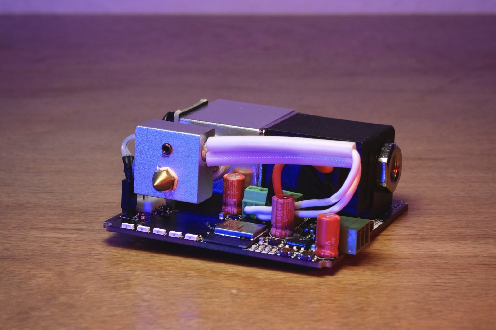
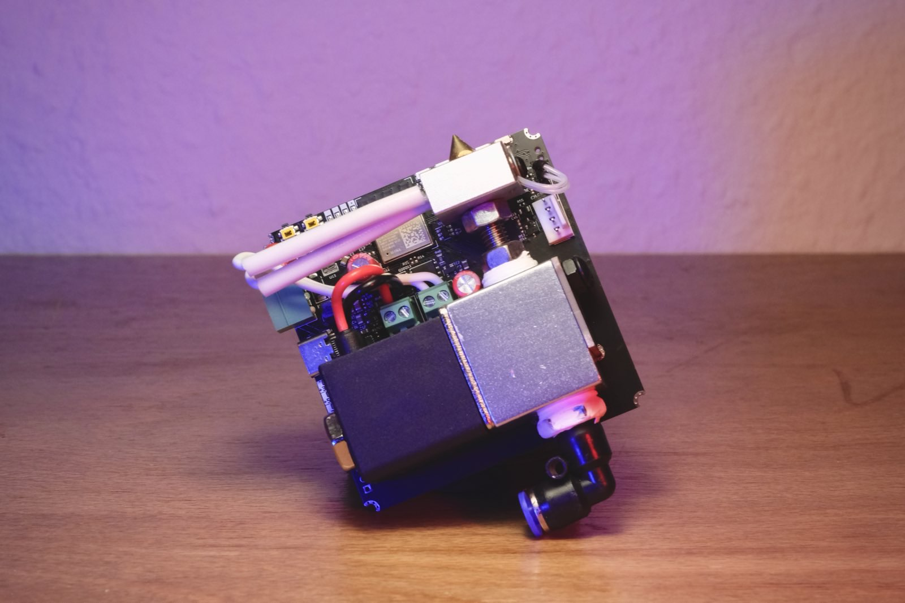
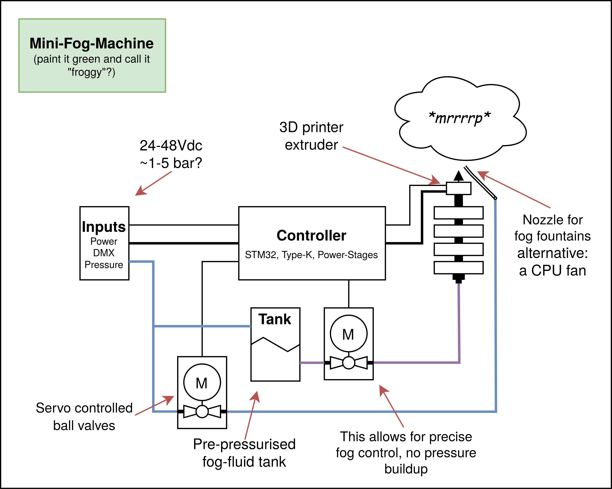

# foxtruder

~~froggy~~, ~~fog-o-nozzle~~, ~~multimist~~, foxtruder [working title] is a tiny fog machine powered by USB-PD, with Wifi and Bluetooth, based around a 3D-printer heat-cartridge and nozzle. As much as I wish to call this the worlds smallest **intentional** fog machine, sadly disposable vapes exist. Otherwise this one would be atop of the smaller fog-machines with a size of just 70x70x35mm. DMX is broken out as well as an external trigger-IO and buttons on the fog machine. It runs Micropython and has some LEDs to colour the fog-cone coming out. To make it this small it however requires an external pump, or rather a pressurized fog-fluid line, which can be connected to the 4mm pneumatic connector at the bottom. The idea here is to just have one fog-juice reservoir and pump for many fog machines. A valve on the board is used to switch the fog. As mentioned before it can be powered from USB-PD or just a DC-input. It either can be controlled via DMX, RS485, USB (python shell), Wifi or Bluetooth. 

Now, you might ask **why**?? To be clear, this is a stupid idea, an intrusive thought turned reality if you will, I'm not even sure if I can recommend you to replicate this. However, the tiny size combined with the low cost per machine of ~20-40€ makes this perfect for larger art-installations requiring fog. Or even better use the fog as the medium of visual art. I.e. in an array, linear arrangement, circular fashion or just many small distributed points of fog generation.

<table>
  <tbody>
    <tr>
      <td>
        
      </td>
      <td>
        
      </td>
    </tr>
  </tbody>
</table>

 I guess this exists now, enjoy?.

### FAQ

##### Can this be run off a MacBooks USB-PD port?

Yes, that was the main mean of development.

### Initial conceptual drawing

This needs updating, but this was the initial idea. The fog-juice tank is an external component now and the additional airflow controller to disturb the fog has not been implemented yet. Otherwise this is fairly true to foxtruder. The fog-juice tank is a real thing and has an input for pressurized air and an outlet for the liquid.

<table>
  <tbody>
    <tr>
      <td>
        
      </td>
    </tr>
  </tbody>
</table>

### On the name

Finding a name for this project was surprisingly complicated, we just included all names we came up with. The initial idea was to "paint it green and call it froggy", like a foggy small frog sitting in the morning mist of a luscious lawn. Then we went towards focussing on the nozzle, the snoot and eventually we arrived at foxtruder, just... don't boop it, it *will* bite.